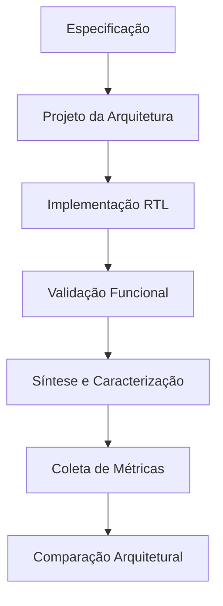
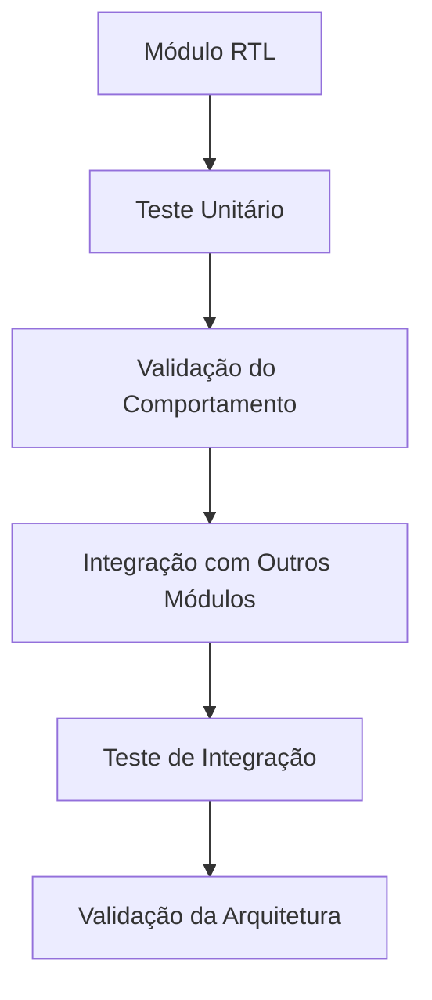
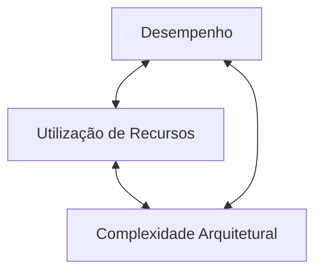
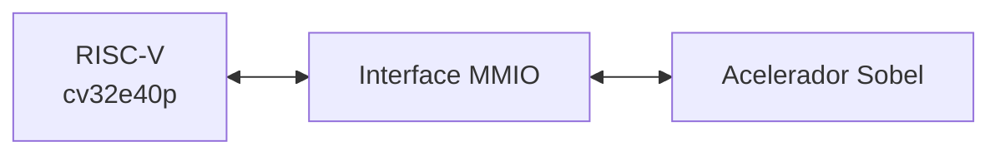
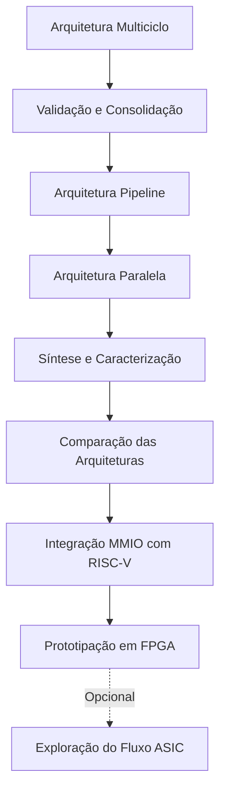

# Acelerador de Hardware para o Filtro de Sobel

Projeto de **Iniciação Científica** voltado ao projeto, implementação e avaliação de diferentes arquiteturas de hardware para aceleração do filtro de detecção de bordas **Sobel**.

A pesquisa investiga diferentes estratégias arquiteturais para a implementação do algoritmo em hardware, analisando os compromissos entre **desempenho, utilização de recursos e complexidade arquitetural**.

A implementação é desenvolvida em **SystemVerilog**, com foco em prototipação em FPGA e na comparação experimental entre diferentes arquiteturas. O projeto também prevê, como etapas posteriores, a integração do acelerador a um sistema baseado no processador **RISC-V `cv32e40p`** e a possível exploração de um fluxo de síntese para ASIC.

> Este projeto é desenvolvido como parte de uma **Iniciação Científica** e será utilizado como base para o **Trabalho de Graduação (TG)** do autor.

---

## 📋 Índice

- [Acelerador de Hardware para o Filtro de Sobel](#acelerador-de-hardware-para-o-filtro-de-sobel)
  - [📋 Índice](#-índice)
- [🎯 Objetivo](#-objetivo)
- [🏗️ Arquiteturas](#️-arquiteturas)
- [🖼️ Filtro de Sobel](#️-filtro-de-sobel)
  - [Kernel horizontal](#kernel-horizontal)
  - [Kernel vertical](#kernel-vertical)
- [🔬 Metodologia](#-metodologia)
- [🧩 Organização do Projeto](#-organização-do-projeto)
- [🧪 Validação](#-validação)
- [📊 Métricas e Avaliação](#-métricas-e-avaliação)
- [🔗 Integração com RISC-V](#-integração-com-risc-v)
- [🖥️ Prototipação em FPGA](#️-prototipação-em-fpga)
- [⚙️ Exploração do Fluxo ASIC](#️-exploração-do-fluxo-asic)
- [🗺️ Roadmap](#️-roadmap)
- [📌 Status Atual](#-status-atual)
- [📚 Documentação](#-documentação)
- [🛠️ Ferramentas](#️-ferramentas)
  - [Desenvolvimento RTL](#desenvolvimento-rtl)
  - [Validação](#validação)
  - [Qualidade de Código](#qualidade-de-código)
  - [Síntese e Implementação](#síntese-e-implementação)
  - [Versionamento e Documentação](#versionamento-e-documentação)
- [🚀 Como Executar](#-como-executar)
- [👨‍🔬 Autoria e Orientação](#-autoria-e-orientação)
  - [Pesquisador](#pesquisador)
  - [Orientador da Iniciação Científica](#orientador-da-iniciação-científica)
  - [Orientador do Trabalho de Graduação](#orientador-do-trabalho-de-graduação)
- [📄 Licença](#-licença)

---

# 🎯 Objetivo

O objetivo deste projeto é projetar, implementar e avaliar diferentes arquiteturas de hardware para a execução do filtro de detecção de bordas de Sobel.

A pesquisa busca investigar os trade-offs entre diferentes estratégias arquiteturais, considerando aspectos como:

- desempenho;
- latência;
- throughput;
- frequência máxima de operação;
- utilização de recursos;
- complexidade arquitetural;
- consumo de potência, quando disponível no fluxo experimental.

As arquiteturas desenvolvidas deverão implementar a mesma especificação funcional, permitindo a realização de comparações consistentes entre diferentes estratégias de execução em hardware.

```mermaid
flowchart TD
    A["Especificação Funcional"] --> B["Arquitetura Multiciclo"]
    A --> C["Arquitetura Pipeline"]
    A --> D["Arquitetura Paralela"]

    B --> E["Avaliação"]
    C --> E
    D --> E

    E --> F["Comparação dos Trade-offs Arquiteturais"]
````

---

# 🏗️ Arquiteturas

O projeto prevê a implementação de três arquiteturas principais para o processamento do filtro de Sobel.

| Arquitetura                 | Descrição                                                                                       | Status               |
| --------------------------- | ----------------------------------------------------------------------------------------------- | -------------------- |
| **Multiciclo / Sequencial** | Reutiliza recursos de hardware ao longo de múltiplos ciclos de clock para processar cada pixel. | 🟡 Em desenvolvimento |
| **Pipeline**                | Divide o processamento em estágios, permitindo a sobreposição da execução de diferentes pixels. | ⚪ Planejada          |
| **Paralela**                | Explora múltiplas unidades de processamento para aumentar o paralelismo e o throughput.         | ⚪ Planejada          |

A arquitetura multiciclo é desenvolvida inicialmente e servirá como **baseline** para a comparação com as arquiteturas posteriores.

```mermaid
flowchart LR
    A["Especificação do Sobel"]

    A --> B["Multiciclo"]
    A --> C["Pipeline"]
    A --> D["Paralela"]

    B --> E["Comparação Arquitetural"]
    C --> E
    D --> E
```

Cada arquitetura poderá explorar um compromisso diferente entre reutilização de recursos, paralelismo, latência e throughput.

---

# 🖼️ Filtro de Sobel

O filtro de Sobel é um operador utilizado para a detecção de bordas em imagens por meio da estimativa dos gradientes horizontal e vertical da intensidade dos pixels.

Para cada janela de $3 \times 3$ pixels, são calculados:

* $G_x$: gradiente horizontal;
* $G_y$: gradiente vertical.

Os gradientes são obtidos por meio da aplicação dos seguintes kernels.

## Kernel horizontal

```text
-1   0  +1
-2   0  +2
-1   0  +1
```

## Kernel vertical

```text
-1  -2  -1
 0   0   0
+1  +2  +1
```

A magnitude do gradiente é aproximada utilizando a norma L1:

$$
|G| = |G_x| + |G_y|
$$

Essa abordagem evita a necessidade do cálculo da raiz quadrada presente na formulação tradicional:

$$
|G| = \sqrt{G^2_x + G^2_y}
$$

A utilização da norma L1 reduz a complexidade da implementação em hardware e permite concentrar a investigação nos diferentes compromissos arquiteturais entre as implementações.

Para a especificação completa do algoritmo e das convenções utilizadas no projeto, consulte:

📄 [`docs/ESPECIFICAÇÃO_SOBEL.md`](docs/ESPECIFICAÇÃO_SOBEL.md)

---

# 🔬 Metodologia

O desenvolvimento das arquiteturas segue um fluxo progressivo, desde a definição da especificação até a comparação experimental.



Cada arquitetura é desenvolvida e validada individualmente antes de ser incorporada à comparação final.

A metodologia busca garantir que as diferentes arquiteturas sejam avaliadas a partir de uma base funcional equivalente, permitindo que as diferenças observadas sejam relacionadas às escolhas arquiteturais realizadas.

---

# 🧩 Organização do Projeto

A implementação é organizada de forma modular, separando componentes reutilizáveis das implementações específicas de cada arquitetura.

```text
.
├── docs/
│   ├── ESPECIFICAÇÃO_SOBEL.md
│   ├── ARQUITETURA_MULTICICLO.md
│   ├── STATUS.md
│   └── ...
│
├── include/
│   └── Arquivos compartilhados e definições comuns
│
├── rtl/
│   ├── common/
│   │   └── Módulos reutilizáveis entre arquiteturas
│   │
│   ├── multicycle/
│   │   └── Implementação da arquitetura multiciclo
│   │
│   ├── pipeline/
│   │   └── Implementação da arquitetura pipeline
│   │
│   └── parallel/
│       └── Implementação da arquitetura paralela
│
├── tb_python/
│   └── Testbenches e infraestrutura de validação
│
├── scripts/
│   └── Scripts auxiliares
│
├── Makefile
├── COMO_VALIDAR.md
└── README.md
```

A estrutura poderá evoluir ao longo do desenvolvimento conforme novas arquiteturas, ferramentas e fluxos experimentais forem incorporados ao projeto.

---

# 🧪 Validação

A validação funcional é realizada progressivamente durante o desenvolvimento.

A infraestrutura de testes busca verificar:

* funcionamento isolado dos módulos;
* integração entre componentes;
* interfaces e sinais de controle;
* comportamento temporal;
* casos de borda;
* processamento contínuo;
* processamento de múltiplos frames consecutivos.



Os testbenches são desenvolvidos em Python utilizando **cocotb**, permitindo a automatização da validação e a comparação do comportamento dos módulos e arquiteturas com a referência definida para o projeto.

A validação não é tratada apenas como uma etapa final: novos componentes são testados progressivamente à medida que são implementados e integrados.

Para informações detalhadas sobre a execução dos testes, consulte:

📄 [`COMO_VALIDAR.md`](COMO_VALIDAR.md)

---

# 📊 Métricas e Avaliação

As arquiteturas serão avaliadas a partir de métricas relacionadas ao desempenho, ao custo de implementação e à eficiência.

| Categoria               | Métricas                                                      |
| ----------------------- | ------------------------------------------------------------- |
| **Desempenho**          | Latência, throughput e frequência máxima                      |
| **Recursos**            | LUTs, Flip-Flops, BRAMs e DSPs                                |
| **Eficiência**          | Relação entre desempenho e utilização de recursos             |
| **Qualidade funcional** | Comparação com a referência funcional definida para o projeto |
| **Potência**            | Consumo energético, quando disponível no fluxo experimental   |

A comparação busca identificar os compromissos entre diferentes dimensões do projeto.



A análise dos resultados buscará identificar como diferentes decisões arquiteturais afetam essas dimensões e quais estratégias apresentam melhor adequação para determinados objetivos.

---

# 🔗 Integração com RISC-V

Uma etapa posterior do projeto prevê a integração do acelerador como um periférico acessível por memória (**Memory-Mapped I/O — MMIO**) em um sistema baseado no core RISC-V:

`cv32e40p`

A integração permitirá explorar o uso do filtro Sobel como um acelerador de hardware especializado acessível por software.



Essa etapa será abordada após a consolidação das arquiteturas principais e da infraestrutura de comparação.

---

# 🖥️ Prototipação em FPGA

O projeto prevê a prototipação das arquiteturas em FPGA.

Essa etapa permitirá analisar características da implementação em hardware, incluindo:

* utilização de recursos;
* frequência máxima de operação;
* desempenho;
* comportamento das diferentes arquiteturas em uma plataforma física.

A plataforma e o fluxo experimental utilizados serão consolidados ao longo do desenvolvimento do projeto.

---

# ⚙️ Exploração do Fluxo ASIC

Como possível extensão da pesquisa, poderá ser realizada uma exploração do fluxo de síntese para ASIC utilizando ferramentas de código aberto.

Essa etapa tem como objetivo complementar a análise das arquiteturas, mas não constitui o núcleo obrigatório da implementação e comparação experimental.

Possíveis ferramentas incluem:

* Yosys;
* OpenLane;
* Sky130.

---

# 🗺️ Roadmap

O desenvolvimento previsto para o projeto segue, de forma geral, o fluxo abaixo.



A ordem e o escopo de algumas etapas poderão ser ajustados de acordo com os resultados obtidos durante a pesquisa.

---

# 📌 Status Atual

<!-- STATUS:START -->

**Última atualização:** 16/08/2026

### Etapa atual

#### Implementação e validação da arquitetura multiciclo.

A arquitetura multiciclo está próxima de sua primeira versão funcional completa. Os módulos comuns e os principais módulos específicos da arquitetura já foram implementados e testados. O foco atual é consolidar o top-level, concluir a validação de integração e fechar os testes relacionados à fronteira entre frames.

### Próximo marco

#### 🎯 Fechar a arquitetura multiciclo

Para considerar a primeira arquitetura concluída:

1. Consolidar o `sobel_multicycle.sv`;
2. Executar o teste de integração ponta a ponta;
3. Validar corretamente múltiplos frames consecutivos;
4. Atualizar a documentação técnica e a auditoria correspondente.

Após isso:

> **Arquitetura multiciclo → baseline funcional para comparação com as arquiteturas pipeline e paralela.**

<!-- STATUS:END -->

Para informações detalhadas e atualizadas sobre o andamento do projeto, consulte:

📄 [`docs/STATUS.md`](docs/STATUS.md)

---

# 📚 Documentação

A documentação técnica é mantida diretamente no repositório.

| Documento                                                     | Descrição                                                              |
| ------------------------------------------------------------- | ---------------------------------------------------------------------- |
| [`STATUS.md`](docs/STATUS.md)                                 | Estado atual do projeto e próximos marcos                              |
| [`ESPECIFICAÇÃO_SOBEL.md`](docs/ESPECIFICAÇÃO_SOBEL.md)       | Especificação do algoritmo e das convenções utilizadas                 |
| [`ARQUITETURA_MULTICICLO.md`](docs/ARQUITETURA_MULTICICLO.md) | Projeto, implementação, decisões e validação da arquitetura multiciclo |
| [`COMO_VALIDAR.md`](COMO_VALIDAR.md)                          | Instruções para execução da infraestrutura de validação                |

A documentação técnica busca registrar não apenas a estrutura final das implementações, mas também decisões arquiteturais relevantes, alternativas avaliadas, problemas encontrados e estratégias de validação.

Dessa forma, o repositório preserva tanto a implementação final quanto parte do raciocínio de engenharia envolvido em seu desenvolvimento.

---

# 🛠️ Ferramentas

O projeto utiliza ou prevê a utilização das seguintes ferramentas e tecnologias.

## Desenvolvimento RTL

* SystemVerilog;
* Icarus Verilog;
* Verilator.

## Validação

* Python;
* cocotb;
* NumPy;
* GTKWave.

## Qualidade de Código

* Verible;
* Verilator Lint.

## Síntese e Implementação

* Intel Quartus;
* Yosys;
* OpenLane.

## Versionamento e Documentação

* Git;
* GitHub;
* Markdown;
* Mermaid.

---

# 🚀 Como Executar

O projeto possui uma infraestrutura baseada em `Makefile` para facilitar a execução dos testes e das ferramentas de validação.

As instruções detalhadas de instalação, configuração e execução estão disponíveis em:

📄 [`COMO_VALIDAR.md`](COMO_VALIDAR.md)

---

# 👨‍🔬 Autoria e Orientação

## Pesquisador

**Caio Rebouças Candolato**

Graduando em *Engenharia da Computação* na *Faculdade ESEG - Grupo ETAPA*

## Orientador da Iniciação Científica

**Bruno**

*Universidade de São Paulo — USP*

## Orientador do Trabalho de Graduação

**Stelvio**

*Faculdade ESEG - Grupo ETAPA*

---

# 📄 Licença

A licença deste projeto será definida posteriormente.

---

> [!NOTE]
> Este repositório está em **desenvolvimento ativo** e poderá evoluir ao longo da pesquisa. A estrutura do projeto, as arquiteturas, a infraestrutura de validação e os resultados experimentais **poderão ser modificados ou expandidos** conforme novas decisões técnicas e resultados forem consolidados.