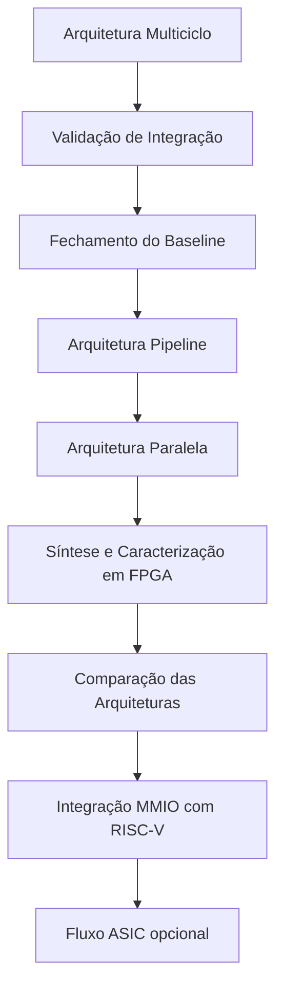

# Status do Projeto

## Resumo

**Última atualização:** 15/08/2026

### Etapa atual

#### Implementação e validação da arquitetura multiciclo.

A arquitetura multiciclo está próxima de sua primeira versão funcional completa. Os módulos comuns e os principais módulos específicos da arquitetura já foram implementados e testados. O foco atual é consolidar o top-level, concluir a validação de integração e fechar os testes relacionados à fronteira entre frames.

### Próximo marco

#### 🎯 Fechar a arquitetura multiciclo

Para considerar a primeira arquitetura concluída:

1. Consolidar o `sobel_multicycle.sv`;
2. Executar o teste de integração ponta a ponta;
3. Validar corretamente múltiplos frames consecutivos;
4. Atualizar a documentação técnica e a auditoria correspondente.

Após isso:

> **Arquitetura multiciclo → baseline funcional para comparação com as arquiteturas pipeline e paralela.**

---

## Progresso das arquiteturas

| Arquitetura             | Estado                         |
| ----------------------- | ------------------------------ |
| Multiciclo / Sequencial | 🟡 Em implementação e validação |
| Pipeline                | ⚪ Não iniciada                 |
| Paralela                | ⚪ Não iniciada                 |

---

## Arquitetura multiciclo

### Concluído

#### Módulos comuns

* [x] `line_buffer_2line.sv`
* [x] `window_3x3.sv`
* [x] `abs_saturate.sv`
* [x] `magnitude_l1.sv`

#### Módulos específicos

* [x] `mac_unit.sv`
* [x] `kernel_rom.sv`
* [x] `mac_control_fsm.sv`

#### Infraestrutura

* [x] Testbenches individuais com cocotb
* [x] Testes de caminho normal e casos de fronteira
* [x] Makefile
* [x] Documentação de validação
* [x] Lint com Verilator e Verible

### Em andamento

* [ ] Consolidação final do `sobel_multicycle.sv`
* [ ] Teste de integração ponta a ponta
* [ ] Teste com 3 ou mais frames consecutivos
* [ ] Formalização do fechamento dos achados da Auditoria 01

O problema de contaminação na fronteira entre frames identificado durante a auditoria foi corrigido na fonte e os testes existentes, incluindo o teste de dois frames consecutivos, estão passando. Ainda falta ampliar essa validação para três ou mais frames antes de considerar a arquitetura definitivamente fechada. 

---

# Principais decisões técnicas

Até o momento:

* Reset assíncrono ativo-baixo (`rst_n`);
* Zero-padding para tratamento de bordas;
* Magnitude aproximada utilizando a norma L1: $|G| = |G_x| + |G_y|$
* Arquitetura multiciclo baseada em uma única unidade MAC reutilizada;
* Coeficientes do Sobel implementados sem multiplicador genérico, explorando coeficientes ±1 e ±2;
* `kernel_rom` separado da FSM para facilitar validação isolada;
* Módulos comuns reutilizáveis entre as três arquiteturas;
* Testes com múltiplos frames consecutivos como requisito de validação para todas as arquiteturas.

---

# Próximas etapas

